# 📐 Enhanced Entity-Relationship (EER) Diagram
## Sithma Driving School Management System

---

## 1. Overview & EER Modeling Principles

The **Sithma Driving School Management System** database is designed to handle multi-branch operations, Department of Motor Traffic (DMT) regulatory milestones, vehicle course packages, practical slot scheduling, multi-tier payments, and trilingual theory examinations.

### Key EER Concepts Applied:
- **Superclass / Subclass Specialization & Generalization**:
  - `USER` superclass specialized into `STUDENT`, `INSTRUCTOR`, `STAFF (Data Entry Officer)`, and `ADMINISTRATOR` (Disjoint, Total participation: $d$, $\cup$).
  - `STUDENT` entity specialized into `TYPE 1 (New Learner)` and `TYPE 2 (Trial-Ready / Existing Permit Holder)` (Disjoint, Total participation: $d$, $\cup$).
- **Weak Entities & Identifying Relationships**:
  - `LEARNER_EXAM_ATTEMPT` (identified via `STUDENT` with partial key `attemptNumber`).
  - `TRIAL_ATTEMPT` (identified via `STUDENT` with partial key `attemptNumber`).
  - `QUIZ_ANSWER_ITEM` (identified via `QUIZ_ATTEMPT` with `questionId`).
- **Composite Attributes**:
  - `bonusLessons` (contains `bike`, `threeWheeler`).
  - `defaultSlotTimes` (contains `startTime`, `endTime`).
- **Multivalued Attributes**:
  - `options` in `QUIZ_QUESTION` (array of 4 distinct answer choices).
  - `instructorIds` in `BRANCH` (assigned instructors).
- **Derived Attributes**:
  - `lessonsRemaining` = $\max(0, \text{lessonsUnlocked} - \text{lessonsUsed})$.
  - `percentage` = $(\text{score} / \text{totalQuestions}) \times 100$.
  - `age` = calculated from `dateOfBirth`.

---

## 2. Visual EER Diagram (Mermaid)

```mermaid
erDiagram
    %% ============================================================
    %% SUPERCLASS & SPECIALIZATION HIERARCHY
    %% ============================================================
    USER {
        string userId PK "ObjectId"
        string name "Full Name"
        string email UK "Unique Email"
        string username UK "Unique Handle"
        string phone "Contact Number"
        string nic "National Identity Card"
        date dateOfBirth "DOB"
        string role "student | staff | instructor | admin"
        string status "active | pending_verification | suspended"
        string branch "Maharagama | Werahara | Delgoda"
        string profilePicture "Avatar File URL"
        string passwordHash "Bcrypt Encrypted"
        datetime createdAt "Timestamp"
    }

    STUDENT {
        string studentId PK "ObjectId"
        string userId FK "References USER(userId)"
        string studentType "Type 1 | Type 2"
        string branch "Assigned Branch"
        string accountStatus "Verified | Unverified"
        boolean isAdvancePaid "Advance Fee Status"
        boolean isPremium "Portal Full Access"
        string packagePaymentStatus "none | pending | confirmed"
        string paymentPlan "full | installments | single"
        int installmentsPaidCount "0 to 3"
        int lessonsUnlocked "Total lessons allowed"
        int lessonsUsed "Completed lessons"
        date medical_date "DMT Medical Scheduled Date"
        string medicalExamStatus "pending | passed | failed"
        date registration_date "DMT Formal Reg Date"
        date written_exam_date "DMT Theory Exam Date"
        string learnerExamStatus "not_taken | passed | failed"
        int learnerExamMarks "Written Score 0-40"
        date trial_date "Practical Trial Exam Date"
        boolean trialEligible "Eligible for Practical"
        string dmt_clearance_proof "Type 2 Permit Proof URL"
        boolean dmt_clearance_verified "Type 2 Clearance Status"
    }

    INSTRUCTOR {
        string instructorId PK "References USER(userId)"
        string teachingCategories "Light | Heavy | Both"
        string assignedBranch "Operating Branch"
    }

    STAFF {
        string staffId PK "References USER(userId)"
        string branch "Branch Office"
        string role "staff (Data Entry Officer)"
    }

    ADMIN {
        string adminId PK "References USER(userId)"
        string accessLevel "executive_super_admin"
    }

    TYPE1_NEW_LEARNER {
        string studentId PK "References STUDENT"
        date medicalExamDate "NTMI Medical Date"
        date dmtRegistrationDate "Formal DMT App Date"
        date learnerExamDate "Written Theory Exam Date"
        int learnerExamMarks "Score (Pass >= 80%)"
        int learnerExamAttempts "1 to 3 attempts"
    }

    TYPE2_TRIAL_READY {
        string studentId PK "References STUDENT"
        string existingPermitNumber "Existing DMT Permit"
        string dmtClearanceProof "Scanned Copy of Permit"
        date clearanceVerifiedAt "DEO Verification Date"
        string clearanceVerifiedBy FK "References USER"
    }

    %% ============================================================
    %% CORE BUSINESS ENTITIES
    %% ============================================================
    BRANCH {
        string branchId PK "ObjectId"
        string name UK "Maharagama | Werahara | Delgoda"
        string address "Physical Address"
        string contactPhone "Branch Telephone"
        int dailySessionSlots "Default: 3 slots/day"
        int sessionDurationMinutes "60 mins"
    }

    PACKAGE {
        string packageId PK "ObjectId"
        string name "Package Display Name"
        string type "Car_Full | Bike_Full | etc."
        string categoryGroup "A (Private) | B (Single) | C (Full)"
        string vehicleCategory "Light | Heavy"
        int lessons "Total standard lessons"
        decimal price "Total Package Cost (LKR)"
        boolean isPerLesson "Daily Single Lesson Flag"
        int bonusBikeLessons "Free Bonus Bike Lessons"
        int bonusThreeWheelLessons "Free Bonus ThreeWheel Lessons"
        string eligibilityCriteria "Requirements"
        boolean isActive "Status"
    }

    TIME_SLOT {
        string timeSlotId PK "ObjectId"
        string branch FK "References BRANCH(name)"
        date date "Scheduled Date"
        string startTime "e.g. 08:30"
        string endTime "e.g. 09:30"
        string lessonTitle "Curriculum Title"
        string lessonTopic "Training Maneuver"
        string instructorId FK "References USER(userId)"
        string vehicleCategory "Light | Heavy"
        string vehicleType "Car | Bike | ThreeWheeler | Bus"
        int capacity "Max students per slot (e.g. 10)"
        int bookedCount "Currently Booked"
        string status "active | cancelled | completed"
    }

    BOOKING {
        string bookingId PK "ObjectId"
        string studentId FK "References STUDENT(studentId)"
        string timeSlotId FK "References TIME_SLOT(timeSlotId)"
        string branch "Branch Name"
        string vehicleType "Car | Bike | ThreeWheeler | Bus"
        string lessonType "regular | free-weekly-class | refresher"
        string status "confirmed | completed | cancelled"
        string cancellationReason "Reason text"
        datetime createdAt "Timestamp"
    }

    PAYMENT {
        string paymentId PK "ObjectId"
        string studentId FK "References STUDENT(studentId)"
        string userId FK "References USER(userId)"
        string packageId FK "References PACKAGE(packageId)"
        string paymentType "advance | package | installment | single_lesson"
        int installmentNumber "1 | 2 | 3"
        string paymentMethod "bank_slip | online_gateway | physical_branch"
        string paymentStatus "Pending Verification | Verified | Rejected"
        decimal amount "Amount in LKR"
        string slipImageUrl "Bank Deposit Receipt URL"
        string transactionReference "Bank / Slip Reference"
        datetime uploadedAt "Upload Timestamp"
        string verifiedBy FK "References USER(userId)"
        datetime verifiedAt "Verification Timestamp"
    }

    RESCHEDULE_REQUEST {
        string requestId PK "ObjectId"
        string student_id FK "References STUDENT(studentId)"
        string requested_by FK "References USER(userId)"
        string milestone_type "medical | registration | theory_exam | trial"
        string reason "Student reason"
        date preferred_date "Proposed Date"
        date previous_date "Existing Date"
        date new_date "Approved New Date"
        string status "Pending | Approved | Rejected"
        string reviewed_by FK "References USER(userId)"
        datetime reviewed_at "DEO Review Date"
        string review_notes "Officer feedback"
    }

    %% ============================================================
    %% WEAK ENTITIES (COMPOSITE / MULTIVALUED LOGS)
    %% ============================================================
    LEARNER_EXAM_ATTEMPT {
        string attemptId PK "ObjectId"
        string studentId FK "References STUDENT(studentId)"
        int attemptNumber "1, 2, or 3 (Partial Key)"
        date date "Exam Date"
        string result "passed | failed"
        int marks "Theory Marks"
        string notes "Remarks"
    }

    TRIAL_ATTEMPT {
        string attemptId PK "ObjectId"
        string studentId FK "References STUDENT(studentId)"
        int attemptNumber "1, 2, or 3 (Partial Key)"
        date date "Trial Date"
        string result "pending | passed | failed"
        string examinerNotes "DMT Examiner Notes"
    }

    %% ============================================================
    %% QUIZ & EXAM SIMULATOR
    %% ============================================================
    QUIZ_QUESTION {
        string questionId PK "ObjectId"
        string questionText "Official DMT Question Text"
        string options "Multivalued: Array[4] choices"
        int correctAnswerIndex "0 to 3"
        string explanation "Learning rationale"
        string language "Sinhala | Tamil | English"
        string vehicleCategory "Light | Heavy"
        string trafficSignImage "Image Asset URL"
        boolean isActive "Active status"
    }

    QUIZ_ATTEMPT {
        string attemptId PK "ObjectId"
        string studentId FK "References STUDENT(studentId)"
        string userId FK "References USER(userId)"
        string language "Sinhala | Tamil | English"
        string vehicleCategory "Light | Heavy"
        int score "Number of Correct Answers"
        int totalQuestions "Standard 40 questions"
        decimal percentage "Derived: (score / total) * 100"
        boolean passed "Derived: percentage >= 80%"
        datetime createdAt "Timestamp"
    }

    QUIZ_ANSWER_ITEM {
        string attemptId FK "References QUIZ_ATTEMPT"
        string questionId FK "References QUIZ_QUESTION"
        int selectedOption "0 to 3"
        int correctOption "0 to 3"
        boolean isCorrect "True | False"
    }

    NOTIFICATION {
        string notificationId PK "ObjectId"
        string recipientId FK "References USER(userId)"
        string recipientRole "student | staff | instructor | admin | all"
        string title "Alert Title"
        string message "Alert Content"
        string type "dmt-date | payment | booking | trial | system"
        boolean read "Unread / Read Flag"
        string link "In-app route link"
        datetime createdAt "Timestamp"
    }

    %% ============================================================
    %% RELATIONSHIPS & CARDINALITIES
    %% ============================================================
    USER ||--o| STUDENT : "specializes into"
    USER ||--o| INSTRUCTOR : "specializes into"
    USER ||--o| STAFF : "specializes into"
    USER ||--o| ADMIN : "specializes into"

    STUDENT ||--o| TYPE1_NEW_LEARNER : "specializes into"
    STUDENT ||--o| TYPE2_TRIAL_READY : "specializes into"

    USER }o--|| BRANCH : "belongs / assigned to"
    STUDENT }o--o| PACKAGE : "enrolled in"
    STUDENT ||--o{ LEARNER_EXAM_ATTEMPT : "records (max 3)"
    STUDENT ||--o{ TRIAL_ATTEMPT : "attempts (max 3)"

    STUDENT ||--o{ BOOKING : "places (0..N)"
    TIME_SLOT ||--o{ BOOKING : "scheduled for (0..10)"
    TIME_SLOT }o--|| BRANCH : "located at"
    TIME_SLOT }o--o| INSTRUCTOR : "dispatched to"

    STUDENT ||--o{ PAYMENT : "makes (1..N)"
    PACKAGE ||--o{ PAYMENT : "paid towards (0..N)"
    USER ||--o{ PAYMENT : "verifies (0..N)"

    STUDENT ||--o{ RESCHEDULE_REQUEST : "requests (0..N)"
    USER ||--o{ RESCHEDULE_REQUEST : "reviews (0..N)"

    STUDENT ||--o{ QUIZ_ATTEMPT : "undertakes (0..N)"
    QUIZ_ATTEMPT ||--|{ QUIZ_ANSWER_ITEM : "contains (40)"
    QUIZ_QUESTION ||--o{ QUIZ_ANSWER_ITEM : "answered in"

    USER ||--o{ NOTIFICATION : "receives (0..N)"
```

---

## 3. Specialization & Generalization Hierarchies

### Hierarchy 1: User Account Specialization
$$\text{USER} \xrightarrow{(d, \text{total})} \{\text{STUDENT}, \text{INSTRUCTOR}, \text{STAFF}, \text{ADMINISTRATOR}\}$$

- **Disjointness ($d$)**: A user cannot simultaneously be a student and an instructor or staff member.
- **Completeness ($\cup$, Total)**: Every user in the system must belong to exactly one of the four roles.
- **Predicate**: Conditioned on `role = 'student' | 'instructor' | 'staff' | 'admin'`.

---

### Hierarchy 2: Student Pathway Specialization
$$\text{STUDENT} \xrightarrow{(d, \text{total})} \{\text{TYPE 1 (New Learner)}, \text{TYPE 2 (Trial-Ready)}\}$$

- **Type 1 (New Learner)**: Standard DMT pipeline. Requires DMT Medical Exam, Learner Driver Registration, and DMT Written Theory Exam (Score $\ge 80\%$, max 3 attempts) before unlocking Practical Trial.
- **Type 2 (Trial-Ready)**: Pre-existing permit holder / conversion. **Exempt** from Medical and Theory exams. Holds `dmt_clearance_proof` verified by a Data Entry Officer (`dmtClearanceVerifiedBy`). Proceeds directly to Practical Trial Date scheduling and vehicle package training.

---

## 4. Entity & Attribute Dictionary

1. **`USER`** (Superclass): `userId` (PK), `name`, `email` (UK), `username` (UK), `phone`, `nic`, `dateOfBirth`, `role`, `status`, `branch`, `profilePicture`, `passwordHash`, `createdAt`.
2. **`STUDENT`** (Subclass of User): `studentId` (PK), `userId` (FK), `studentType`, `branch`, `accountStatus`, `isAdvancePaid`, `isPremium`, `packagePaymentStatus`, `paymentPlan`, `installmentsPaidCount`, `lessonsUnlocked`, `lessonsUsed`, `trial_date`, `trial_date_set_by` (FK), `trial_eligible`, `dmt_clearance_proof`, `dmt_clearance_verified`.
3. **`PACKAGE`**: `packageId` (PK), `name`, `type`, `categoryGroup`, `vehicleCategory`, `lessons`, `price`, `isPerLesson`, `bonusLessons` (composite: `bike`, `threeWheeler`), `eligibilityCriteria`, `isActive`.
4. **`BRANCH`**: `branchId` (PK), `name` (UK), `address`, `contactPhone`, `dailySessionSlots`, `sessionDurationMinutes`, `defaultSlotTimes` (composite/multivalued).
5. **`TIME_SLOT`**: `timeSlotId` (PK), `branch` (FK), `date`, `startTime`, `endTime`, `lessonTitle`, `lessonTopic`, `instructorId` (FK), `vehicleCategory`, `vehicleType`, `capacity`, `bookedCount`, `status`.
6. **`BOOKING`**: `bookingId` (PK), `studentId` (FK), `timeSlotId` (FK), `branch`, `vehicleType`, `lessonType`, `status`, `cancellationReason`, `createdAt`.
7. **`PAYMENT`**: `paymentId` (PK), `studentId` (FK), `userId` (FK), `packageId` (FK), `paymentType`, `installmentNumber`, `paymentMethod`, `paymentStatus`, `amount`, `slipImageUrl`, `transactionReference`, `verifiedBy` (FK), `uploadedAt`, `verifiedAt`.
8. **`RESCHEDULE_REQUEST`**: `requestId` (PK), `student_id` (FK), `requested_by` (FK), `milestone_type`, `reason`, `preferred_date`, `previous_date`, `new_date`, `status`, `reviewed_by` (FK), `reviewed_at`, `review_notes`.
9. **`QUIZ_QUESTION`**: `questionId` (PK), `questionText`, `options` (multivalued array[4]), `correctAnswerIndex`, `explanation`, `language`, `vehicleCategory`, `trafficSignImage`, `isActive`.
10. **`QUIZ_ATTEMPT`**: `attemptId` (PK), `studentId` (FK), `userId` (FK), `language`, `vehicleCategory`, `score`, `totalQuestions`, `percentage` (derived), `passed` (derived), `createdAt`.
11. **`QUIZ_ANSWER_ITEM`** (Weak entity): `attemptId` (FK), `questionId` (FK), `selectedOption`, `correctOption`, `isCorrect`.
12. **`NOTIFICATION`**: `notificationId` (PK), `recipientId` (FK), `recipientRole`, `title`, `message`, `type`, `read`, `link`, `createdAt`.

---

## 5. Relationships, Cardinality & Participation Matrix

| Relationship | Entity 1 | Entity 2 | Cardinality | Participation 1 | Participation 2 | Description |
| :--- | :--- | :--- | :---: | :---: | :---: | :--- |
| **Profile Link** | `USER` | `STUDENT` | $1 : 1$ | Partial | Total | A student profile requires a valid User record. |
| **Branch Allocation** | `BRANCH` | `USER` | $1 : N$ | Partial | Total | Every user is affiliated with a branch. |
| **Package Enrollment** | `PACKAGE` | `STUDENT` | $1 : N$ | Partial | Partial | Student enrolls in 1 course package. |
| **Slot Location** | `BRANCH` | `TIME_SLOT` | $1 : N$ | Total | Total | Each slot belongs to 1 branch. |
| **Instructor Assignment**| `INSTRUCTOR` | `TIME_SLOT` | $1 : N$ | Partial | Partial | Instructor conducts training slots. |
| **Lesson Reservation** | `STUDENT` | `BOOKING` | $1 : N$ | Partial | Total | Student makes multiple slot bookings. |
| **Slot Capacity** | `TIME_SLOT` | `BOOKING` | $1 : N$ | Partial | Total | Slots contain up to 10 student bookings. |
| **Payment Fee** | `STUDENT` | `PAYMENT` | $1 : N$ | Total | Total | Student makes multiple payments. |
| **Payment Verification**| `STAFF` | `PAYMENT` | $1 : N$ | Partial | Partial | Officer verifies submitted payment slips. |
| **Reschedule Filing** | `STUDENT` | `RESCHEDULE_REQ` | $1 : N$ | Partial | Total | Student submits milestone date reschedules. |
| **Reschedule Decision** | `STAFF` | `RESCHEDULE_REQ` | $1 : N$ | Partial | Partial | Officer reviews and approves/rejects. |
| **Mock Quiz Session** | `STUDENT` | `QUIZ_ATTEMPT` | $1 : N$ | Partial | Total | Student completes practice theory tests. |
| **Answer Logging** | `QUIZ_ATTEMPT` | `QUIZ_ANSWER_ITEM` | $1 : N$ | Total | Total | Attempt contains 40 answered question items. |
| **Alert Notification** | `USER` | `NOTIFICATION` | $1 : N$ | Partial | Total | Targeted system and milestone alerts. |

---

## 6. Relational Schema Mapping (3NF Tables)

1. **`Users`** ($\underline{\text{userId}}$, name, email, username, phone, nic, dob, role, status, branch, profilePicture, passwordHash, createdAt)
2. **`Students`** ($\underline{\text{studentId}}$, $\text{userId}^*$, studentType, branch, accountStatus, isAdvancePaid, isPremium, packagePaymentStatus, paymentPlan, installmentsPaidCount, lessonsUnlocked, lessonsUsed, $\text{packageId}^*$, medical_date, medicalExamStatus, registration_date, written_exam_date, learnerExamStatus, learnerExamMarks, trial_date, $\text{trial\_date\_set\_by}^*$, dmt_clearance_proof, dmt_clearance_verified)
3. **`Packages`** ($\underline{\text{packageId}}$, name, type, categoryGroup, vehicleCategory, lessons, price, isPerLesson, bonusBikeLessons, bonusThreeWheelLessons, eligibilityCriteria, isActive)
4. **`Branches`** ($\underline{\text{branchId}}$, name, address, contactPhone, dailySessionSlots, sessionDurationMinutes)
5. **`TimeSlots`** ($\underline{\text{timeSlotId}}$, branch, date, startTime, endTime, lessonTitle, lessonTopic, $\text{instructorId}^*$, vehicleCategory, vehicleType, capacity, bookedCount, status)
6. **`Bookings`** ($\underline{\text{bookingId}}$, $\text{studentId}^*$, $\text{timeSlotId}^*$, branch, vehicleType, lessonType, status, cancellationReason, createdAt)
7. **`Payments`** ($\underline{\text{paymentId}}$, $\text{studentId}^*$, $\text{userId}^*$, $\text{packageId}^*$, paymentType, installmentNumber, paymentMethod, paymentStatus, amount, slipImageUrl, transactionReference, uploadedAt, $\text{verifiedBy}^*$, verifiedAt)
8. **`RescheduleRequests`** ($\underline{\text{requestId}}$, $\text{student\_id}^*$, $\text{requested\_by}^*$, milestone_type, reason, preferred_date, previous_date, new_date, status, $\text{reviewed\_by}^*$, reviewed_at, review_notes)
9. **`QuizQuestions`** ($\underline{\text{questionId}}$, questionText, options_JSON, correctAnswerIndex, explanation, language, vehicleCategory, trafficSignImage, isActive)
10. **`QuizAttempts`** ($\underline{\text{attemptId}}$, $\text{studentId}^*$, $\text{userId}^*$, language, vehicleCategory, score, totalQuestions, percentage, passed, createdAt)
11. **`QuizAnswerItems`** ($\underline{\text{attemptId}^*, \text{questionId}^*}$, selectedOption, correctOption, isCorrect)
12. **`Notifications`** ($\underline{\text{notificationId}}$, $\text{recipientId}^*$, recipientRole, title, message, type, read, link, createdAt)
